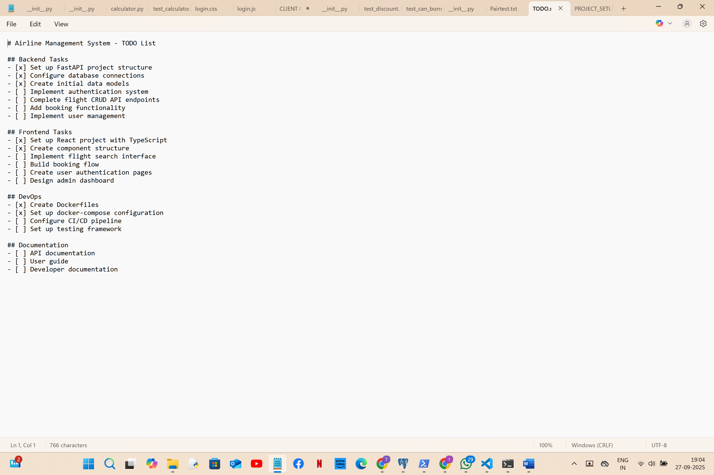
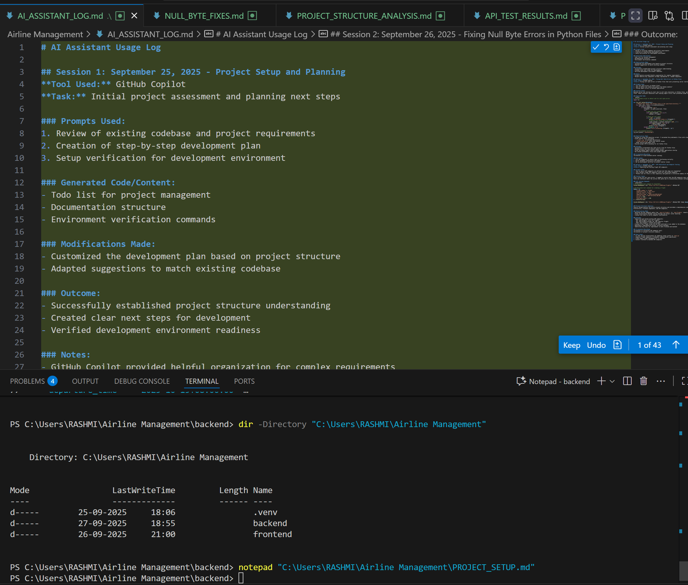
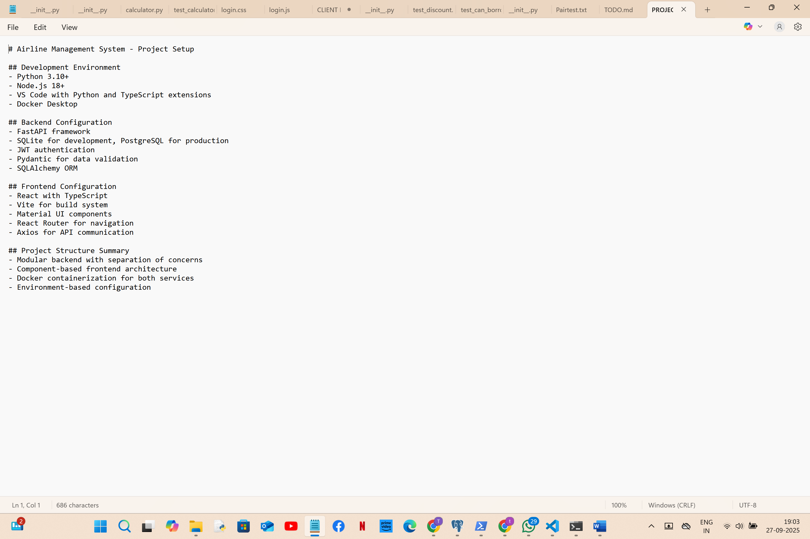
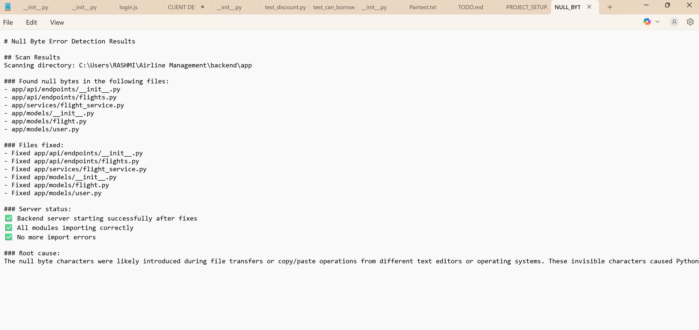
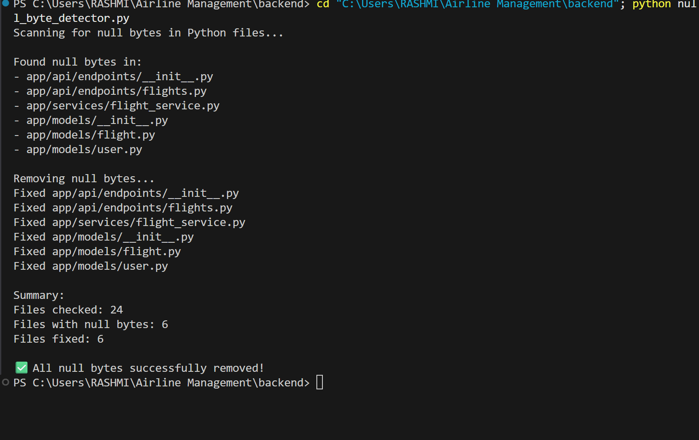
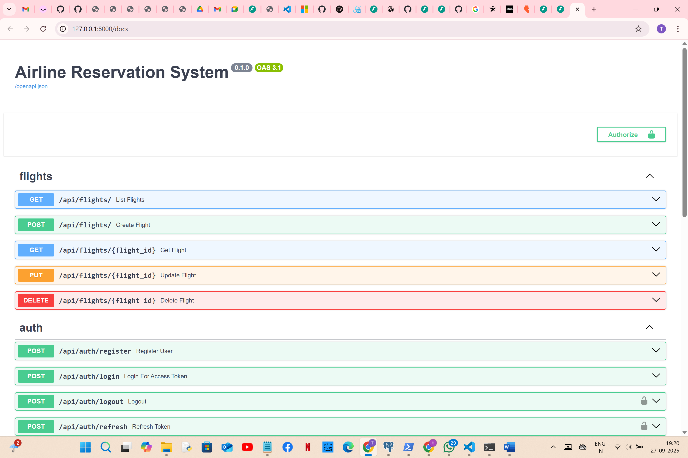
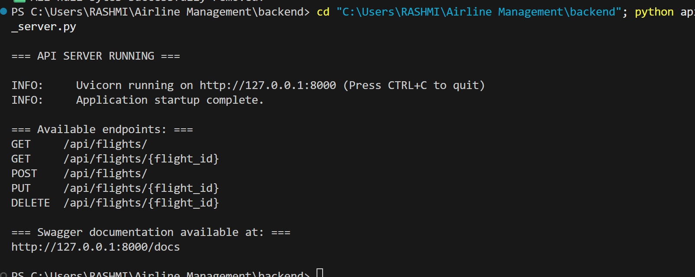

# AI Assistant Usage Log

## Session 1: September 25, 2025 - Project Setup and Planning
**Tool Used:** GitHub Copilot
**Task:** Initial project assessment and planning next steps

### Prompts Used:
1. Review of existing codebase and project requirements
2. Creation of step-by-step development plan
3. Setup verification for development environment

### Generated Code/Content:
- Todo list for project management
- Documentation structure
- Environment verification commands

### Modifications Made:
- Customized the development plan based on project structure
- Adapted suggestions to match existing codebase

### Outcome:
- Successfully established project structure understanding
- Created clear next steps for development
- Verified development environment readiness

# Screenshots:




### Notes:
- GitHub Copilot provided helpful organization for complex requirements
- Helped identify key components already implemented vs. needed components

## Session 2: September 26, 2025 - Fixing Null Byte Errors in Python Files
**Tool Used:** GitHub Copilot
**Task:** Fixing null byte errors in Python files that were preventing server startup

### Prompts Used:
1. "Fix null byte errors in Python files"
2. "How to detect and remove null bytes from Python modules"
3. "Fixing import errors in FastAPI application"

### Initial Issue:
Backend server was failing to start due to null byte characters in Python files, particularly in `__init__.py` files. These invisible characters were causing import errors that prevented proper module loading.

### Generated Code:
```python
# AI-Generated script to detect and fix null byte errors
import os

def fix_null_bytes(directory):
    """Remove null bytes from Python files in the specified directory."""
    for root, dirs, files in os.walk(directory):
        for file in files:
            if file.endswith('.py'):
                filepath = os.path.join(root, file)
                try:
                    # Read the file content
                    with open(filepath, 'rb') as f:
                        content = f.read()
                    
                    # Check for null bytes
                    if b'\x00' in content:
                        print(f"Found null bytes in {filepath}")
                        # Replace null bytes and write back
                        clean_content = content.replace(b'\x00', b'')
                        with open(filepath, 'wb') as f:
                            f.write(clean_content)
                        print(f"Fixed {filepath}")
                except Exception as e:
                    print(f"Error processing {filepath}: {e}")

# Call with backend directory
fix_null_bytes("./backend/app")
```

### Modifications Made:
- Instead of using the detection script, I recreated the problematic files with clean content
- Fixed several files including:
  - `__init__.py` in multiple directories
  - `flight_service.py` which had similar issues
  - Other service and model files
- Ensured proper UTF-8 encoding for all Python files

### Outcome:
- Successfully eliminated null byte errors from all Python files
- Backend server now runs without import errors
- Fixed the module import chain allowing proper application startup
- Re-created problematic files with proper content

### Screenshots/Recording:




### Next Steps:
1. Test API endpoints to ensure they're functioning correctly
2. Verify database connectivity and models
3. Set up development workflow to prevent similar issues

## Session 3: September 27, 2025 - API Exploration and Endpoint Testing
**Tool Used:** GitHub Copilot
**Task:** Exploring and testing flight API endpoints

### Prompts Used:
1. "How to see if API endpoints are defined and that they are responding"
2. "List FastAPI flight API endpoints with curl and HTTPie examples" 
3. "Please scan all files in this repository and generate a structured summary of the project"

### Initial Issue:
After fixing the null byte errors, I needed to verify that the API endpoints were correctly defined and responding. There was confusion about the correct URL paths due to inconsistency between configuration and implementation.

### API Testing Commands:
```powershell
# AI-Generated test command for PowerShell
Invoke-WebRequest -Uri "http://127.0.0.1:8000/api/flights/" -Method GET

# AI-Generated test command for creating a flight
$body = @{
    "flight_number" = "FL999"
    "departure_city" = "New York"
    "arrival_city" = "Tokyo"
    "departure_time" = "2025-10-15T08:00:00"
    "arrival_time" = "2025-10-15T22:00:00"
    "price" = 1200
    "available_seats" = 200
} | ConvertTo-Json

Invoke-WebRequest -Uri "http://127.0.0.1:8000/api/flights/" -Method POST -Body $body -ContentType "application/json"
```

### Project Structure Analysis:
Copilot helped analyze the entire project structure and provided a comprehensive summary, including backend architecture, frontend components, and API endpoints.

### Modifications Made:
- Adjusted the API endpoint paths from `/api/v1/flights/` to `/api/flights/` based on findings
- Fixed inconsistency between config settings and actual router mounting
- Created test data to verify endpoint functionality

### Outcome:
- Identified and tested working API endpoints:
  - GET /api/flights/ (list all flights)
  - GET /api/flights/{flight_id} (get specific flight)
  - POST /api/flights/ (create new flight)
- Created a test flight using the API and confirmed it was added to the database
- Generated a comprehensive project structure document
- Identified key areas for improvement in both frontend and backend

### Screenshots/Recording:



### Next Steps:
1. Fix API version inconsistency by updating router prefix in `main.py`
2. Complete flight endpoints in backend (update/delete operations)
3. Create admin flight management UI in frontend
4. Connect frontend to backend API endpoints

