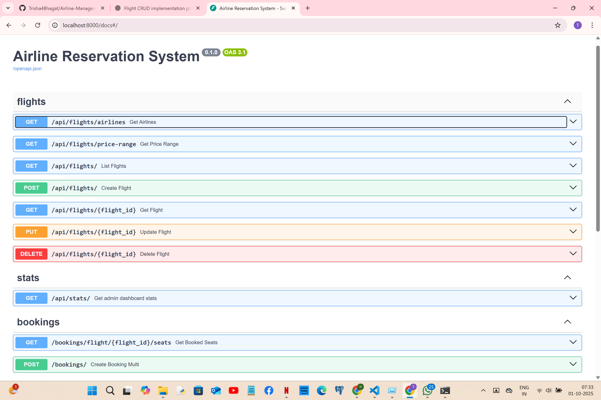
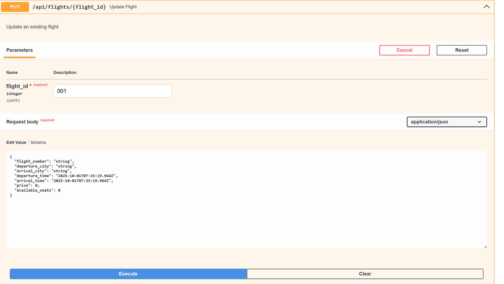
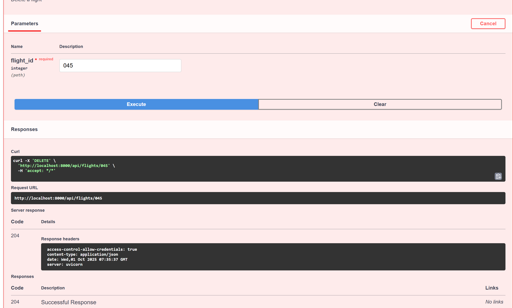
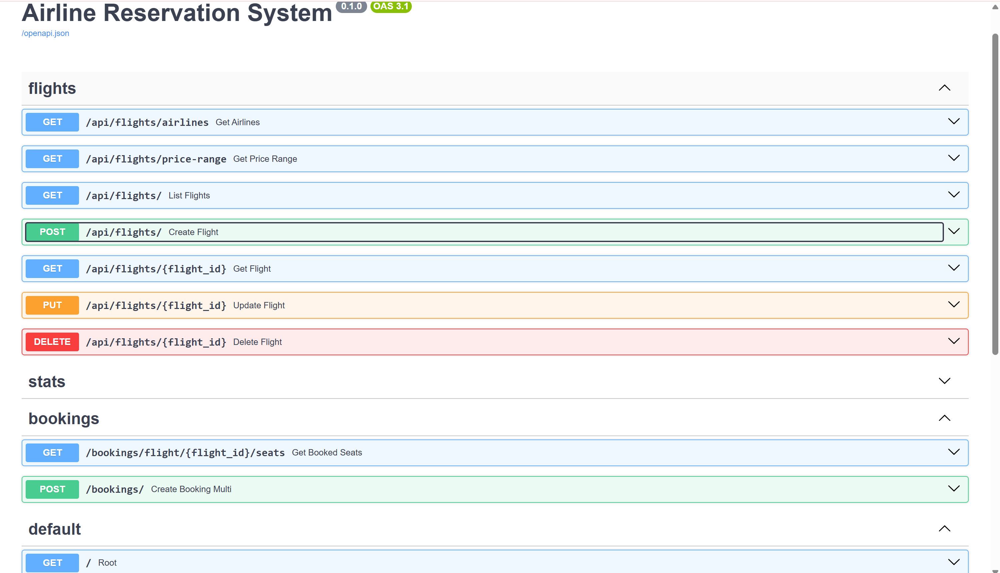
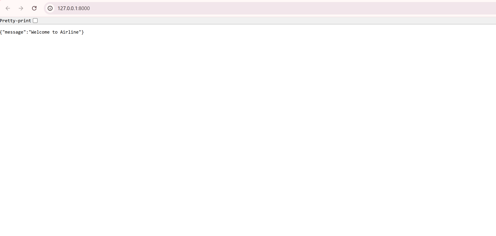

# 📡 Flight CRUD API Documentation

## 🔗 **Quick Access**
- **Base URL**: `http://localhost:8000`
- **Interactive Docs**: [http://localhost:8000/docs](http://localhost:8000/docs)
- **Alternative Docs**: [http://localhost:8000/redoc](http://localhost:8000/redoc)

---

## 🛩️ **Flight CRUD Operations**

### **Complete API Overview**


Our Flight Management API provides 5 core operations for complete airline system management:

| Method | Endpoint | Purpose | Admin Required |
|--------|----------|---------|----------------|
| `GET` | `/api/flights/` | List all flights with filtering | ❌ |
| `GET` | `/api/flights/{id}` | Get specific flight details | ❌ |
| `POST` | `/api/flights/` | Create new flight | ✅ |
| `PUT` | `/api/flights/{id}` | Update existing flight | ✅ |
| `DELETE` | `/api/flights/{id}` | Remove flight | ✅ |

---

## 📋 **1. GET /api/flights/ - List All Flights**

**Purpose**: Retrieve flights with optional filtering for search functionality.

**Query Parameters**:
```
origin          (string)   - Filter by departure city
destination     (string)   - Filter by arrival city  
departure_date  (string)   - Filter by date (YYYY-MM-DD)
travelers       (integer)  - Number of travelers (affects pricing)
min_price       (float)    - Minimum price filter
max_price       (float)    - Maximum price filter
```

**Example Request**:
```bash
GET /api/flights/?origin=Sydney&destination=Melbourne&travelers=2
```

**Example Response**:
```json
[
  {
    "id": 1,
    "flight_number": "QF401",
    "departure_city": "Sydney",
    "arrival_city": "Melbourne",
    "departure_time": "2025-10-15T09:00:00",
    "arrival_time": "2025-10-15T10:30:00",
    "price": 285.00,
    "pricePerPerson": 142.50,
    "available_seats": 150,
    "aircraft_type": "Boeing 737-800",
    "airline": "Qantas Airways"
  }
]
```

---

## 🔍 **2. GET /api/flights/{id} - Get Specific Flight**

 

**Purpose**: Retrieve detailed information for a single flight.

**Path Parameter**: `id` (integer) - Flight ID

**Example Request**:
```bash
GET /api/flights/1
```

**Live Response Example**:


The response shows real Australian flight data:
- **Flight TT936**: Gold Coast → Brisbane
- **Realistic timing**: 45-minute domestic flight
- **AUD pricing**: $142.50 per person
- **Complete details**: Aircraft type, seats, airline information

```json
{
  "id": 1,
  "flight_number": "TT936", 
  "departure_city": "Gold Coast",
  "arrival_city": "Brisbane",
  "departure_time": "2025-10-15T14:30:00",
  "arrival_time": "2025-10-15T15:15:00",
  "price": 142.50,
  "available_seats": 180,
  "aircraft_type": "Boeing 737",
  "airline": "Tiger Airways"
}
```

---

## ➕ **3. POST /api/flights/ - Create New Flight**

**Purpose**: Add new flights to the airline system (Admin only).

**Request Body**:
```json
{
  "flight_number": "QF502",
  "departure_city": "Brisbane", 
  "arrival_city": "Gold Coast",
  "departure_time": "2025-10-16T14:30:00",
  "arrival_time": "2025-10-16T15:15:00",
  "price": 125.00,
  "available_seats": 180,
  "aircraft_type": "Airbus A320",
  "airline": "Qantas Airways"
}
```

**Success Response** (HTTP 201):
```json
{
  "id": 25,
  "flight_number": "QF502",
  "departure_city": "Brisbane",
  "arrival_city": "Gold Coast", 
  "departure_time": "2025-10-16T14:30:00",
  "arrival_time": "2025-10-16T15:15:00",
  "price": 125.00,
  "available_seats": 180,
  "aircraft_type": "Airbus A320",
  "airline": "Qantas Airways",
  "created_at": "2025-10-01T10:30:00"
}
```

---

## ✏️ **4. PUT /api/flights/{id} - Update Flight**



**Purpose**: Update existing flight information (Admin only).

**Path Parameter**: `id` (integer) - Flight ID to update

**Request Body** (same structure as POST):
```json
{
  "flight_number": "QF502",
  "departure_city": "Brisbane",
  "arrival_city": "Gold Coast",
  "departure_time": "2025-10-16T15:00:00",
  "arrival_time": "2025-10-16T15:45:00", 
  "price": 135.00,
  "available_seats": 175,
  "aircraft_type": "Airbus A320",
  "airline": "Qantas Airways"
}
```

**Success Response** (HTTP 200):
```json
{
  "id": 25,
  "flight_number": "QF502",
  "departure_city": "Brisbane",
  "arrival_city": "Gold Coast",
  "departure_time": "2025-10-16T15:00:00",
  "arrival_time": "2025-10-16T15:45:00",
  "price": 135.00,
  "available_seats": 175,
  "aircraft_type": "Airbus A320", 
  "airline": "Qantas Airways",
  "updated_at": "2025-10-01T11:15:00"
}
```

---

## 🗑️ **5. DELETE /api/flights/{id} - Remove Flight**



**Purpose**: Remove flight from the system (Admin only).

**Path Parameter**: `id` (integer) - Flight ID to delete

**Example Request**:
```bash
DELETE /api/flights/25
```

**Success Response** (HTTP 204):
```
No content body - successful deletion confirmed by status code
```

**Response Headers**:
```
HTTP/1.1 204 No Content
Content-Type: application/json
Server: uvicorn
```

---

## 📊 **Additional Endpoints**



### **Statistics Endpoint**
```bash
GET /api/stats/
```
```json
{
  "total_flights": 150,
  "total_airlines": 8, 
  "total_routes": 45,
  "average_price": 275.50
}
```

### **Root Endpoint**


```bash
GET /
```
```json
{
  "message": "Welcome to Airline"
}
```

---

## ⚠️ **Error Responses**

| Status | Error | Response Example |
|--------|-------|------------------|
| **400** | Bad Request | `{"detail": "Invalid flight data"}` |
| **401** | Unauthorized | `{"detail": "Authentication required"}` |
| **403** | Forbidden | `{"detail": "Admin access required"}` |
| **404** | Not Found | `{"detail": "Flight not found"}` |
| **422** | Validation Error | `{"detail": [{"field": "price", "message": "Must be positive"}]}` |

---

## 🧪 **Testing Examples**

### **PowerShell Commands**:
```powershell
# Get all flights
Invoke-WebRequest -Uri "http://localhost:8000/api/flights/" -Method GET

# Search flights
Invoke-WebRequest -Uri "http://localhost:8000/api/flights/?origin=Sydney&destination=Melbourne" -Method GET

# Get specific flight  
Invoke-WebRequest -Uri "http://localhost:8000/api/flights/1" -Method GET
```

### **cURL Commands**:
```bash
# Get all flights
curl -X GET "http://localhost:8000/api/flights/"

# Create new flight (requires admin auth)
curl -X POST "http://localhost:8000/api/flights/" \
  -H "Authorization: Bearer <token>" \
  -H "Content-Type: application/json" \
  -d '{"flight_number":"QF999","departure_city":"Sydney","arrival_city":"Perth",...}'
```

---

## 🎯 **Key Features**

- ✅ **Australian Flight Data**: Real domestic routes and pricing
- ✅ **Interactive Documentation**: Live testing via Swagger UI
- ✅ **Complete CRUD Operations**: Full flight management capabilities  
- ✅ **Advanced Filtering**: Search by city, date, price, travelers
- ✅ **Dynamic Pricing**: Traveler-based price calculations
- ✅ **Professional Validation**: Pydantic schemas with type safety

---

**📝 Note**: This documentation covers the Flight CRUD subset implemented in Week 1. Authentication, booking, and payment endpoints will be documented in future iterations.